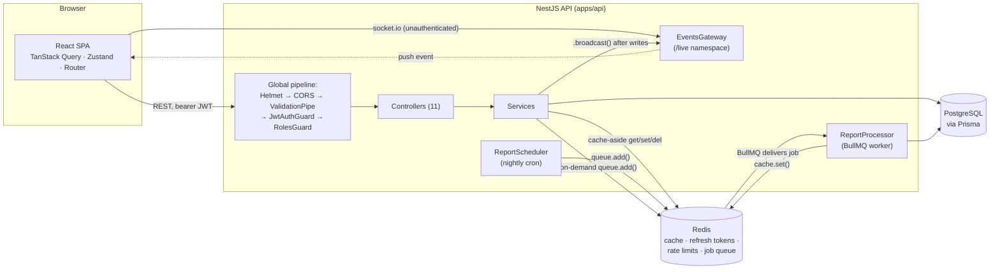
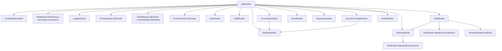
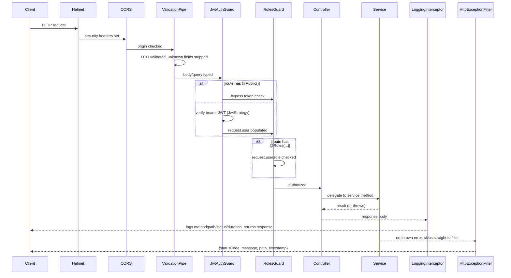
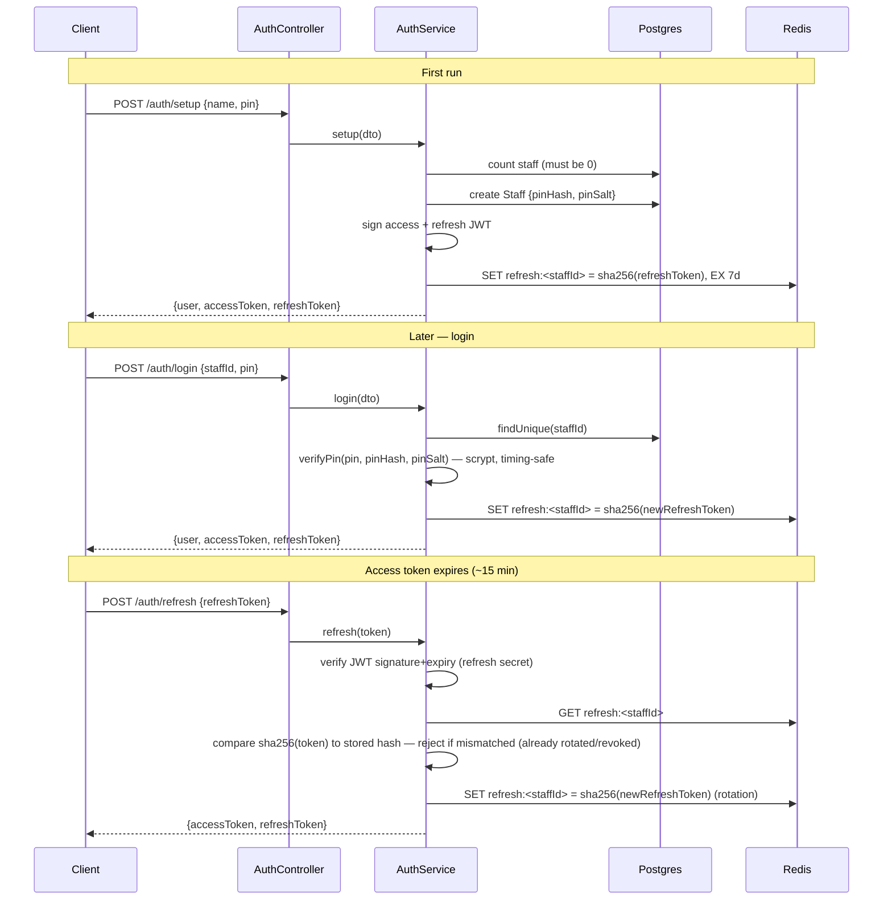
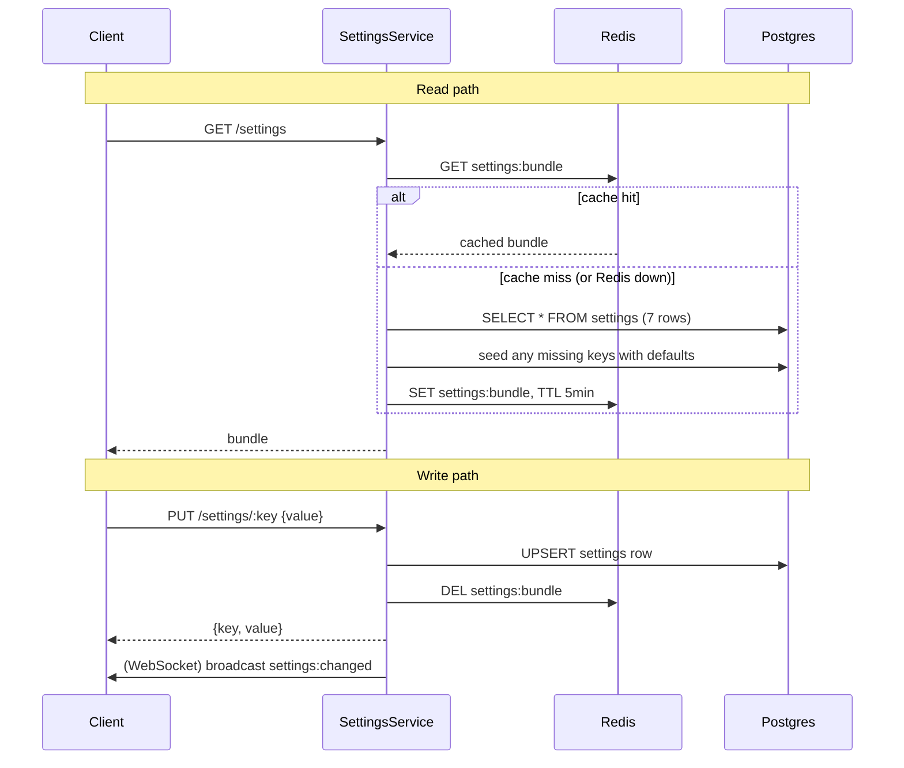
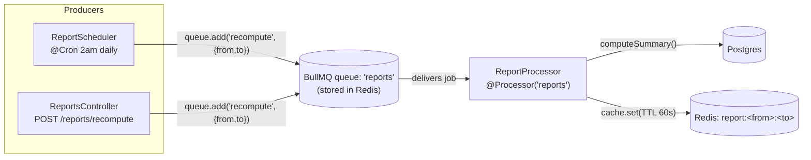
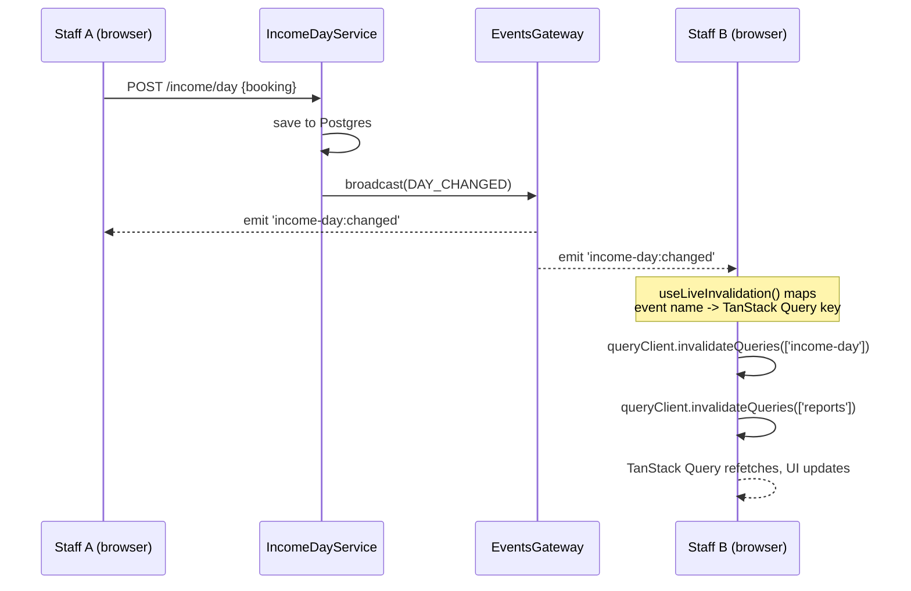
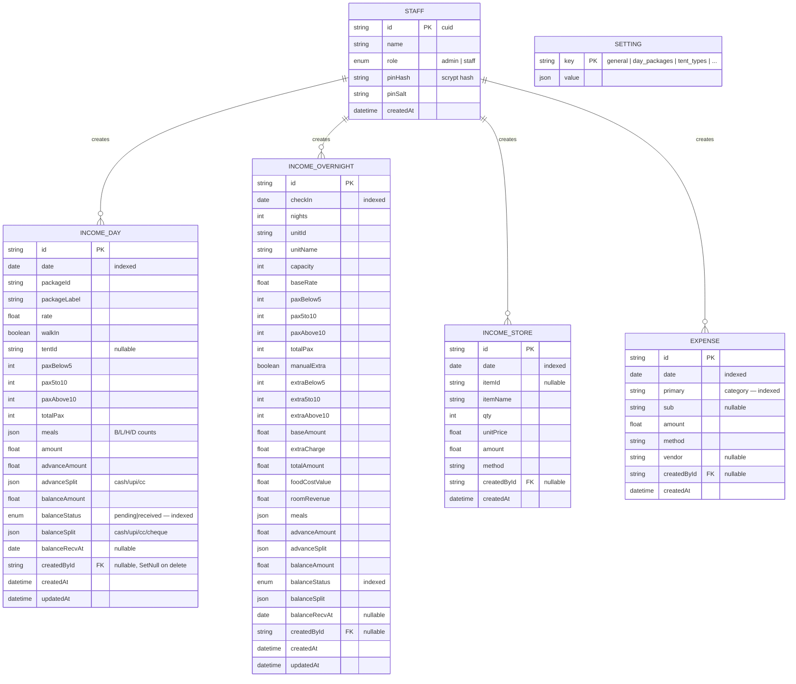
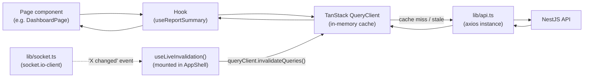
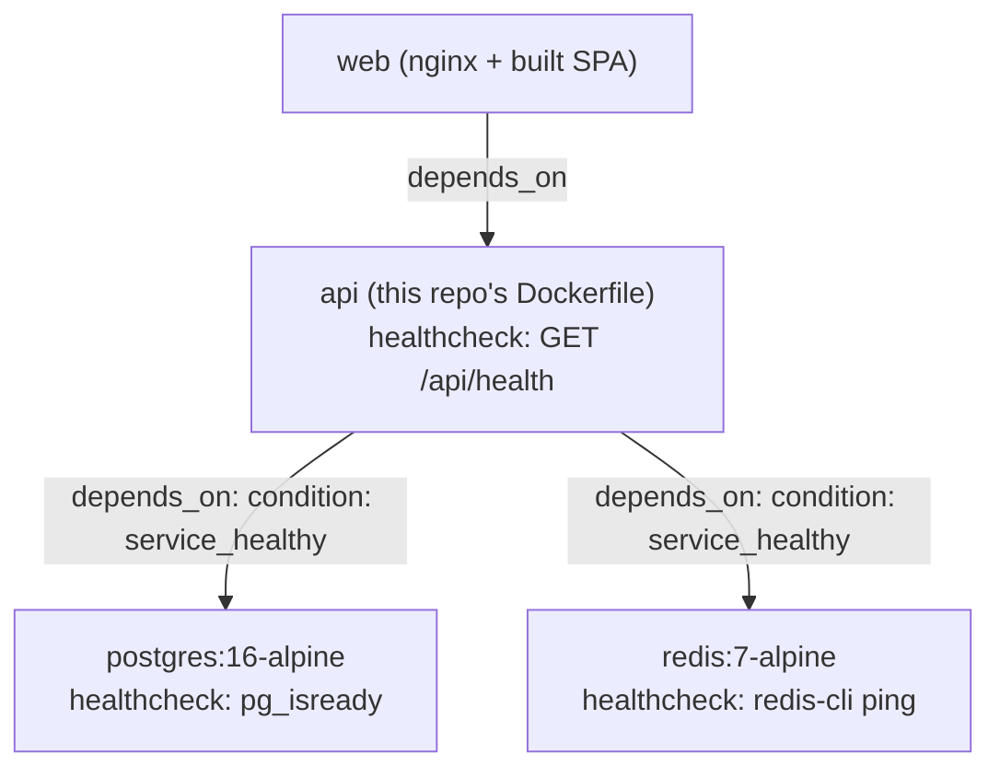

# Architecture

Technical reference for Camp Dilly Ledger — Platform Edition: what each
technology does in this system, how the pieces integrate, the database
schema, and the class/module structure of both apps. For the *why* behind
each choice (not just the *what*), see [README.md](./README.md) — this
document is the structural map; the README is the design rationale.

**Contents**
1. [Tech stack at a glance](#1-tech-stack-at-a-glance)
2. [System architecture](#2-system-architecture)
3. [Repository layout](#3-repository-layout)
4. [Backend: NestJS module graph](#4-backend-nestjs-module-graph)
5. [Backend: request lifecycle](#5-backend-request-lifecycle)
6. [Backend: class reference, module by module](#6-backend-class-reference-module-by-module)
7. [Authentication & authorization](#7-authentication--authorization)
8. [Caching architecture](#8-caching-architecture)
9. [Background jobs (BullMQ)](#9-background-jobs-bullmq)
10. [Real-time updates (WebSocket)](#10-real-time-updates-websocket)
11. [Database schema](#11-database-schema)
12. [Redis key namespace](#12-redis-key-namespace)
13. [Frontend: React architecture](#13-frontend-react-architecture)
14. [Shared package](#14-shared-package-camp-dillyshared)
15. [Build & deployment](#15-build--deployment)

---

## 1. Tech stack at a glance

| Layer | Technology | Role in this system |
|---|---|---|
| Monorepo | npm workspaces | One `npm install` at the root wires `packages/shared`, `apps/api`, `apps/web` together via symlinks — no Lerna/Nx/Turborepo needed at this scale. |
| Backend framework | NestJS 10 (TypeScript) | Modular DI container; every feature is a `Module` of `Controller` + `Service` + `DTO`s. |
| Database | PostgreSQL 16 | System of record. Relational columns for anything reports filter/sort/aggregate on; JSONB for genuinely nested data. |
| ORM | Prisma 5 | Schema-first models, migrations tooling, type-safe query builder, `groupBy`/`aggregate` for reporting. |
| Cache / broker | Redis 7 | Four distinct roles — see [§8](#8-caching-architecture): HTTP response cache-aside, refresh-token store, rate-limit counters, BullMQ's job store. |
| Job queue | BullMQ | Background report-cache warming, decoupled from the request/response cycle. |
| Scheduling | `@nestjs/schedule` | Cron trigger for the nightly cache-warm job. |
| Realtime | Socket.IO (`@nestjs/websockets`) | Broadcast-only "something changed" signal so open dashboards refresh without polling. |
| Auth | `@nestjs/jwt` + `passport-jwt` + hand-rolled Redis session store | Stateless short-lived access tokens, stateful revocable refresh tokens. |
| Validation | `class-validator` + `class-transformer` | Every request body is a typed DTO, validated and whitelisted before it reaches a service. |
| API docs | `@nestjs/swagger` | Auto-generated OpenAPI + interactive UI at `/docs`, driven by the same DTOs and decorators used for validation. |
| Logging | Winston (`nest-winston`) | Structured JSON logs in production, readable colorized text in dev. |
| Frontend framework | React 18 + TypeScript + Vite | SPA, fast dev server, Rollup production build. |
| Routing | React Router 6 | Client-side routes, one per screen. |
| Server state | TanStack Query 5 | Cache, retry, and invalidate server data — replaces hand-rolled `reload()` calls. |
| Client state | Zustand | The one piece of state that's genuinely client-only: the in-memory access token and the toast queue. |
| Forms | React Hook Form + Zod | Field-driven forms with schema validation (not used on the two booking pages — see [§13.2](#132-state-management-three-layers-used-deliberately)). |
| Styling | Tailwind CSS | Utility classes over the same CSS-custom-property palette the vanilla build uses. |
| Charts | Recharts | Donut and trend charts on Dashboard/Reports. |
| Containerization | Docker (multi-stage) + Docker Compose | `docker compose up --build` builds and runs all four services with health-gated startup order. |
| Reverse proxy | nginx | Serves the built SPA and proxies `/api` and `/live` to the API container in the production compose profile. |
| CI | GitHub Actions | Spins up real Postgres + Redis service containers, then build+test+lint both apps. |

---

## 2. System architecture



Every mutating request follows the same shape: **Controller → Service →
Prisma (write) → Redis (invalidate/broadcast where relevant)**. Every read
follows: **Controller → Service → Redis (cache check) → Prisma (on miss) →
Redis (repopulate)**.

---

## 3. Repository layout

```
camp-dilly-showcase/
├── packages/shared/            # types + pricing logic — imported by both apps
│   ├── src/types.ts              # DTOs shared with the frontend, LIVE_EVENTS map
│   ├── src/calc.ts               # computeDayPicnic, computeOvernight, autoSplitExtra
│   ├── src/calc.test.ts          # 10 Jest tests — the only thing with unit tests
│   └── src/index.ts              # explicit re-exports (see §14 for why not `export *`)
│
├── apps/api/                   # NestJS backend
│   ├── prisma/schema.prisma      # §11
│   └── src/
│       ├── main.ts                 # bootstrap: Helmet, CORS, ValidationPipe, Swagger
│       ├── app.module.ts           # root module — wires every feature module + global providers
│       ├── config/                 # typed ConfigService factory
│       ├── prisma/                 # PrismaService (DI-managed PrismaClient)
│       ├── redis/                  # RedisService (raw ioredis) + CacheModule registration
│       ├── common/                 # guards, filters, interceptors, decorators — cross-cutting
│       ├── auth/                   # setup/login/refresh/logout, JWT strategy, PIN hashing
│       ├── staff/                  # staff CRUD (admin-only mutations)
│       ├── settings/               # cache-aside key/value config store
│       ├── income-day/             # day-picnic booking CRUD + pricing
│       ├── income-overnight/       # overnight booking CRUD + pricing
│       ├── store/                  # in-house store sales
│       ├── expenses/               # categorized expenses
│       ├── reports/                # cache-aside aggregation + BullMQ producer
│       ├── jobs/                   # BullMQ processor + cron scheduler
│       ├── events/                 # WebSocket gateway
│       └── health/                 # liveness/readiness probe
│
└── apps/web/                   # React frontend
    └── src/
        ├── main.tsx, App.tsx        # entry point, router, auth bootstrap
        ├── lib/                     # api client, query client, socket, date-range math
        ├── store/                   # Zustand: authStore, toastStore
        ├── hooks/                   # one TanStack Query hook module per resource
        ├── components/ui/           # Button, Card, Modal, Stepper, SplitEditor, ...
        ├── components/charts/       # DonutChart, TrendChart (Recharts)
        ├── components/layout/       # AppShell (topbar + sidebar + drawer)
        └── pages/                   # one component per route
```

---

## 4. Backend: NestJS module graph

Arrows are `imports:` relationships from each `@Module()` decorator.
`PrismaModule`, `RedisModule`, and `EventsModule` are `@Global()` — every
other module can inject `PrismaService`, `RedisService`, or
`EventsGateway` without importing them explicitly.



`IncomeDayModule` and `IncomeOvernightModule` import `SettingsModule`
because both need the current day-package / tent-type / rate configuration
to price a booking — they call `SettingsService.getBundle()` rather than
querying `Setting` rows directly, which means booking pricing automatically
benefits from the settings cache too.

`JobsModule` imports `ReportsModule` so `ReportProcessor` can reuse
`ReportsService.computeAndCache()` instead of duplicating the aggregation
query — the worker and the HTTP cache-miss path share one implementation.

---

## 5. Backend: request lifecycle



`JwtAuthGuard` and `RolesGuard` are registered **globally** in
`app.module.ts` via `APP_GUARD` — every route requires a valid access token
by default. `AuthController`'s `staff`/`setup`/`login`/`refresh` endpoints
are the explicit exceptions, marked `@Public()`, along with
`HealthController` (Docker's healthcheck has no JWT to present — this was a
real bug caught during Docker integration testing; see README's honesty
note). `HttpExceptionFilter` and `LoggingInterceptor` are also global
(`APP_FILTER` / `APP_INTERCEPTOR`), so every controller gets consistent
error shape and access logging for free.

---

## 6. Backend: class reference, module by module

### `auth/` — session issuance, PIN verification

| File | Class / export | Responsibility |
|---|---|---|
| `auth.controller.ts` | `AuthController` | `GET staff` (public roster), `POST setup`, `POST login` (rate-limited), `POST refresh`, `POST logout`, `GET me`. |
| `auth.service.ts` | `AuthService` | `setup()`, `login()`, `refresh()`, `logout()` — orchestrates Prisma (staff lookup) + Redis (refresh-token store) + JWT signing. |
| `pin.util.ts` | `hashPin`, `verifyPin` | scrypt-based PIN hashing with per-user salt, timing-safe comparison. |
| `strategies/jwt.strategy.ts` | `JwtStrategy` | Passport strategy verifying the access-token signature/expiry; `validate()` return value becomes `request.user`. |
| `dto/*.ts` | `SetupDto`, `LoginDto`, `RefreshDto` | class-validator-annotated request shapes. |

### `staff/` — staff account management (admin-gated mutations)

| File | Class | Responsibility |
|---|---|---|
| `staff.controller.ts` | `StaffController` | `GET /staff` (any authenticated staff), `POST/PATCH/DELETE` (`@Roles('admin')`). |
| `staff.service.ts` | `StaffService` | Create staff, reset PIN (also revokes that staff's refresh token — see [§7](#7-authentication--authorization)), remove staff (blocked if it's the last one). |

### `settings/` — key/value configuration store

| File | Class | Responsibility |
|---|---|---|
| `settings.service.ts` | `SettingsService` | `getBundle()` (cache-aside read, seeds defaults for missing keys), `updateKey()` (write + cache invalidation + WebSocket broadcast). |
| `settings.controller.ts` | `SettingsController` | `GET /settings`, `PUT /settings/:key` (`@Roles('admin')`). |
| `defaults.ts` | `SETTINGS_DEFAULTS`, `SETTINGS_KEYS` | The flyer's day packages, tent types, extra-person rates, expense categories, store items — seeded once, editable after. |

### `income-day/`, `income-overnight/` — booking CRUD + pricing

| File | Class | Responsibility |
|---|---|---|
| `income-day.service.ts` | `IncomeDayService` | `list/create/update/updateBalance/remove`. `buildPayload()` re-fetches the current package + walk-in surcharge from `SettingsService` and calls `computeDayPicnic()` — **the server never trusts a client-sent amount**. Broadcasts `DAY_CHANGED` after every write. |
| `income-overnight.service.ts` | `IncomeOvernightService` | Same shape; `buildPayload()` calls `computeOvernight()` with the unit's capacity/rate, extra-person rates, and food-cost-per-head. |
| `*.controller.ts` | `IncomeDayController`, `IncomeOvernightController` | Thin — `list` (query-filtered), `create`, `update`, `PATCH :id/balance` (mark received), `delete`. |
| `dto/create-*-entry.dto.ts` | nested DTOs (`SplitDto`, `AdvanceDto`, `BalanceDto`) | Deeply validated with `@ValidateNested()` + `@Type()` — a malformed payment split is rejected before it reaches the service. |

### `store/`, `expenses/` — simpler CRUD

| File | Class | Responsibility |
|---|---|---|
| `store.service.ts` | `StoreService` | Sales log: `qty × unitPrice`, broadcasts `STORE_CHANGED`. |
| `expenses.service.ts` | `ExpensesService` | Categorized expense log, filterable by category, broadcasts `EXPENSE_CHANGED`. |

### `reports/` — cache-aside aggregation + job producer

| File | Class | Responsibility |
|---|---|---|
| `reports.service.ts` | `ReportsService` | `getSummary()` (cache-aside, TTL-only — see [§8](#8-caching-architecture)), `computeSummary()` (the actual Prisma aggregation: `findMany` for income sources reduced in JS, `groupBy`/`aggregate` for expense-by-category), `enqueueRecompute()` (adds a BullMQ job), `computeAndCache()` (used by both the HTTP cache-miss path and the job worker). |
| `reports.controller.ts` | `ReportsController` | `GET /reports/summary`, `POST /reports/recompute` (`@Roles('admin')`). |

### `jobs/` — BullMQ worker + scheduler

| File | Class | Responsibility |
|---|---|---|
| `report.processor.ts` | `ReportProcessor extends WorkerHost` | `@Processor('reports')` — consumes queued jobs, calls `ReportsService.computeAndCache()`. |
| `report.scheduler.ts` | `ReportScheduler` | `@Cron(EVERY_DAY_AT_2AM)` — enqueues a "recompute this month" job nightly. |

### `events/` — WebSocket gateway

| File | Class | Responsibility |
|---|---|---|
| `events.gateway.ts` | `EventsGateway` | `@WebSocketGateway({namespace:'/live'})`. `broadcast(event)` emits to every connected client. No auth — see [§10](#10-real-time-updates-websocket) for why that's a deliberate, safe choice here. |

### `common/` — cross-cutting concerns

| File | Export | Responsibility |
|---|---|---|
| `guards/jwt-auth.guard.ts` | `JwtAuthGuard` | Global guard; checks `@Public()` metadata via `Reflector` before delegating to Passport's JWT check. |
| `guards/roles.guard.ts` | `RolesGuard` | Global guard; no-ops when a route has no `@Roles()` metadata, else checks `request.user.role`. |
| `guards/redis-throttler.guard.ts` | `RedisThrottlerGuard`, `Throttle()` | Hand-rolled fixed-window rate limiter (`INCR` + `EXPIRE`), applied only to `/auth/login`. Fails **open** if Redis is unreachable. |
| `decorators/public.decorator.ts` | `Public()` | Marks a route exempt from `JwtAuthGuard`. |
| `decorators/roles.decorator.ts` | `Roles(...roles)` | Attaches required-role metadata for `RolesGuard`. |
| `decorators/current-user.decorator.ts` | `CurrentUser()` | Param decorator pulling the JWT-verified user off the request. |
| `dto/update-balance.dto.ts` | `UpdateBalanceDto` | Shared between `income-day` and `income-overnight` — the "mark received" payload is identical for both. |
| `filters/http-exception.filter.ts` | `HttpExceptionFilter` | Global `@Catch()` — normalizes every thrown error into one JSON shape, logs 5xx at error level (with stack) vs 4xx at warn level. |
| `interceptors/logging.interceptor.ts` | `LoggingInterceptor` | Global — logs `METHOD path -> status (Nms) by <staffId>` for every request. |
| `logger/logger.module.ts` | `LoggerModule` | Configures Winston: JSON in production, colorized `nest-winston` formatting in dev. |

### `prisma/`, `redis/` — infrastructure modules

| File | Class | Responsibility |
|---|---|---|
| `prisma.service.ts` | `PrismaService extends PrismaClient` | DI-managed connection lifecycle (`onModuleInit`/`onModuleDestroy`), so Prisma is mockable in tests and shuts down cleanly. |
| `redis.service.ts` | `RedisService` | Wraps a raw `ioredis` client for the two things `cache-manager` doesn't fit: `storeRefreshToken`/`getRefreshTokenHash`/`revokeRefreshToken`, and `hitRateLimit()`. |
| `redis.module.ts` | `RedisModule` | Registers both `RedisService` **and** Nest's `CacheModule` (backed by `cache-manager-ioredis-yet`) against the same Redis instance — two abstractions, one store. |

---

## 7. Authentication & authorization

**Design**: short-lived stateless access tokens (15 min) + longer-lived
stateful refresh tokens (7 days) whose *hash* lives in Redis, keyed by
staff id. A PIN reset or "logout everywhere" is a single `DEL` — no
Postgres write, and a stolen refresh token that's already been rotated
away is rejected because its hash no longer matches Redis.



`JwtStrategy.validate()` returns only the JWT's own claims
(`{id, name, role}`) — there's **no Postgres round-trip on every
authenticated request**. The tradeoff: a role change or a rename takes
effect only once the staff member's access token next refreshes (≤15 min),
not instantly. Reasonable for an 8-15 person resort staff, called out
explicitly rather than silently accepted.

---

## 8. Caching architecture

Two Redis-backed caches exist for two different reads, deliberately using
**different consistency policies** rather than one cache shape copy-pasted
twice:

### 8.1 Settings — cache-aside, explicit invalidation



Settings are read on nearly every page load but change rarely — cached
with a 5-minute TTL **and** actively evicted the instant an admin saves, so
a write is never left stale for a reader.

### 8.2 Reports — TTL-only, no write-triggered invalidation

`GET /reports/summary?from&to` is cached per date range
(`report:<from>:<to>`) for 60 seconds, full stop — a booking write does
**not** evict it. Recomputing that aggregation on every single booking
write (across four tables) would cost far more than the report being up to
a minute stale is worth. If a manager wants it fresher *right now*, `POST
/reports/recompute` enqueues a BullMQ job that recomputes and re-caches
immediately (see [§9](#9-background-jobs-bullmq)) — same underlying
`computeAndCache()`, invoked on demand instead of waiting out the TTL.

Both cache reads are wrapped in `try/catch`: a Redis outage degrades to
"always hit Postgres," never a 500 — see `SettingsService`/`ReportsService`
for the exact pattern.

---

## 9. Background jobs (BullMQ)



Two producers, one consumer: whether a human clicked "Recompute" or the
2am cron fired, the same `ReportProcessor.process()` handles it, calling
straight into `ReportsService.computeAndCache()` — the exact same method
the HTTP cache-miss path uses, so there's one aggregation implementation,
not two. The nightly job exists purely for **cache warming**: the first
person opening Reports each morning gets a hit instead of paying for the
aggregation query.

---

## 10. Real-time updates (WebSocket)



The gateway (`/live` namespace) is **unauthenticated by design**: every
event it emits is just a name (`income-day:changed`,
`settings:changed`, ...) — never a booking amount, a guest name, or
anything else worth protecting. It's an invalidation signal, not a data
channel; the actual data always comes back through the JWT-guarded REST
API when the client refetches. That's what lets the socket connection skip
auth entirely without weakening the app's real security boundary.

`LIVE_EVENTS` (the five event names) lives in `packages/shared/src/types.ts`
so the emitting side (`EventsGateway.broadcast()`) and the listening side
(`useLiveInvalidation.ts`'s event→query-key map) can't drift apart.

---

## 11. Database schema



**Modeling decision** (also noted at the top of `schema.prisma`): columns
that reports actually filter, sort, or aggregate on — `date`, amounts,
`balanceStatus`, expense `primary` category — are real typed Postgres
columns with `@@index`. Genuinely nested, non-queried structures — the
per-meal-type counts, the four-way payment split — are `Json` (JSONB).
That's a deliberate middle ground, not "everything relational" or
"everything JSON": `ReportsService` can run a native `groupBy` on
`primary` category (see [§6](#6-backend-class-reference-module-by-module))
because it's a column, while `meals`/`advanceSplit`/`balanceSplit` never
need their own query predicates so JSONB costs nothing.

**No sessions table.** Deliberately — see [§7](#7-authentication--authorization).
Every other piece of mutable app state lives in Postgres; only ephemeral,
revocable session state lives in Redis.

**Soft staff deletion via `onDelete: SetNull`**: deleting a `Staff` row
nulls out `createdById` on their historical entries rather than cascading
— a resort's booking history shouldn't disappear because someone removed a
former employee's account.

Full field-level detail (types, defaults, `@@map` table names) is in
[`apps/api/prisma/schema.prisma`](./apps/api/prisma/schema.prisma) — this
diagram is the map, that file is the ground truth.

---

## 12. Redis key namespace

One Redis instance, four independent uses, kept apart by key prefix:

| Key pattern | Written by | Read by | TTL | Purpose |
|---|---|---|---|---|
| `settings:bundle` | `SettingsService.updateKey()` (deletes it) / `getBundle()` (repopulates) | `SettingsService.getBundle()` | 5 min | Cache-aside for the settings bundle — see [§8.1](#81-settings--cache-aside-explicit-invalidation). |
| `report:<from>:<to>` | `ReportsService.getSummary()` / `computeAndCache()` | `ReportsService.getSummary()` | 60 s | TTL-only report cache — see [§8.2](#82-reports--ttl-only-no-write-triggered-invalidation). One key per distinct date range requested. |
| `refresh:<staffId>` | `AuthService` (login/setup/refresh), `StaffService` (deletes on PIN reset/removal) | `AuthService.refresh()` | 7 days (matches refresh-token expiry) | SHA-256 hash of the current valid refresh token — see [§7](#7-authentication--authorization). |
| `rate:<route>:<ip>` | `RedisThrottlerGuard.hitRateLimit()` | same | window-scoped (60 s for login) | Fixed-window request counter for `/auth/login`. |
| `bull:reports:*` | BullMQ internals | BullMQ internals | managed by BullMQ | Job queue storage, delayed/completed/failed job bookkeeping, stalled-job detection — Camp Dilly code never touches these directly. |

`RedisService` (raw `ioredis`) owns the `refresh:*` and `rate:*`
namespaces. Nest's `CacheModule` (`cache-manager` +
`cache-manager-ioredis-yet`, injected via `CACHE_MANAGER`) owns
`settings:bundle` and `report:*`. `BullModule` owns `bull:reports:*`. All
three point at the **same** Redis instance/connection config — the split
is about using the right abstraction per job, not running three caches.

---

## 13. Frontend: React architecture

### 13.1 Routing

| Path | Page component | Guarded? |
|---|---|---|
| `/login` | `LoginPage` | Redirects to `/` if already authenticated |
| `/` | `DashboardPage` | Yes — wrapped in `ProtectedRoute` + `AppShell` |
| `/day-picnic` | `DayPicnicPage` | Yes |
| `/overnight` | `OvernightPage` | Yes |
| `/store` | `StorePage` | Yes |
| `/expenses` | `ExpensesPage` | Yes |
| `/payments` | `PaymentsPage` | Yes |
| `/reports` | `ReportsPage` | Yes |
| `/settings` | `SettingsPage` | Yes |
| `*` | redirect to `/` | — |

`App.tsx` also runs `useAuthBootstrap()` once on mount: if a refresh token
exists in `localStorage` but there's no in-memory access token yet (a page
reload), it silently exchanges the refresh token before rendering any
route — a reload never bounces a logged-in user to `/login`.

### 13.2 State management — three layers, used deliberately

| Layer | Tool | Used for | Why not the others |
|---|---|---|---|
| Server state | TanStack Query | Every resource fetched from the API — bookings, settings, reports, staff. One `useQuery`/`useMutation` hook module per resource in `hooks/`. | This *is* what TanStack Query is for; hand-rolling cache/retry/invalidation would just be a worse version of it. |
| Client-only state | Zustand | `authStore` (in-memory access token, staff identity, persisted refresh token), `toastStore`. | This state doesn't come from the server and doesn't need TanStack Query's fetch/cache machinery — a global store is simpler. |
| Form/derived state | plain `useState` | The two booking forms (`DayPicnicPage`, `OvernightPage`), where every pax-stepper tap recomputes a live total via `computeDayPicnic`/`computeOvernight`. | React Hook Form is built around field-level validation-on-submit, not a form whose *entire visible total* recalculates on every keystroke. Using it here anyway would fight the tool. |
| Form/derived state | React Hook Form + Zod | `ExpensesPage`'s entry form — a plain field-to-submit shape with no derived state. | The right tool for *this* form; see the code comment at the top of `ExpensesPage.tsx` for the explicit reasoning. |

### 13.3 Data flow



`lib/api.ts`'s axios instance carries the access token from `authStore` on
every request via a request interceptor, and on a `401` response, queues a
single in-flight token refresh (concurrent 401s from several parallel
queries all await the *same* refresh call rather than racing five separate
ones) before retrying the original request once.

### 13.4 Component reference

| Directory | Contents |
|---|---|
| `components/ui/` | `Button`, `Card`/`Tile`, `Field`/`Input`/`Select`, `Modal`, `Pill`, `RangeBar`, `SplitEditor`, `Stepper`, `Toaster` — presentational, no data fetching. |
| `components/charts/` | `DonutChart`, `TrendChart` — thin Recharts wrappers taking already-shaped data. |
| `components/layout/` | `AppShell` (topbar, responsive sidebar/drawer, mounts `useLiveInvalidation`), `navItems.ts` (the nav list, single source for both sidebar and drawer). |
| `components/PendingList.tsx` | Shared between `DashboardPage` (top 5) and `PaymentsPage` (full list) — renders pending balances and owns the "mark received" modal (`SplitEditor` + date picker). |

---

## 14. Shared package (`@camp-dilly/shared`)

`packages/shared/src/calc.ts` holds `computeDayPicnic`,
`computeOvernight`, and `autoSplitExtra` — pure functions with **zero**
dependencies on Nest, React, or a database. They're imported:

- by the **API** (`income-day.service.ts`, `income-overnight.service.ts`) as the authoritative, server-side recompute on every save — a client can never write an arbitrary price;
- by the **web app** (`DayPicnicPage.tsx`, `OvernightPage.tsx`) for instant live-preview totals as the pax steppers are tapped, before the request round-trips.

One implementation, ten Jest tests (`calc.test.ts`), no chance of the
preview and the saved number silently disagreeing.

**A build quirk worth knowing if you touch this package**: `index.ts`
re-exports every value as an explicit `const` re-assignment
(`import {X as _X} from './mod'; export const X = _X;`) rather than
`export * from './mod'` or `export {X} from './mod'`. Both of those
compile to a CommonJS getter-based re-export that Rollup's named-export
detection didn't reliably see through when the web app consumed the
compiled `dist/`. The web app additionally aliases `@camp-dilly/shared`
straight to this package's **TypeScript source** in
`apps/web/vite.config.ts` (`resolve.alias`), sidestepping CJS/ESM interop
for that consumer entirely — Vite compiles it as native first-party
TS/ESM. The API is unaffected: it consumes the compiled `dist/` via plain
Node `require()`, which has no such ambiguity.

---

## 15. Build & deployment

### 15.1 Docker images — multi-stage builds

Both `apps/api/Dockerfile` and `apps/web/Dockerfile` follow the same
shape: a full `node:20-slim` **build** stage compiles TypeScript (and the
shared package), then a slim **runtime** stage copies over only what's
needed to run.

**API image** — two things worth knowing if you modify it (both were real
bugs caught during Docker integration testing, not hypothetical):
- `node:20-slim` ships without OpenSSL, which Prisma's native engine binaries need — both stages `apt-get install openssl`.
- npm workspaces hoists Prisma's generated client to the monorepo's **root** `node_modules/.prisma`, not `apps/api/node_modules/.prisma` — the runtime stage's `COPY --from=build` reflects that.
- Bootstraps the schema with `prisma db push --skip-generate`, not `prisma migrate deploy` — see the README's "deliberate simplification" note on why this repo ships without a committed migration history.

**Web image** — `apps/web/Dockerfile` builds the Vite production bundle,
then an `nginx:1.27-alpine` stage serves it. `apps/web/nginx.conf` does two
jobs: `try_files ... /index.html` for React Router's client-side routes,
and reverse-proxies `/api/*` and `/live/*` to the `api` container so the
browser only ever talks to one origin in the containerized profile
(matching what Vite's dev-server proxy does for local dev).

### 15.2 `docker-compose.yml` service graph



`api`'s own healthcheck hits `/api/health`, which itself pings both
Postgres (`SELECT 1`) and Redis (`PING`) — Compose won't report the `api`
service healthy until both its real dependencies are actually reachable,
not just "the process started."

### 15.3 CI (`.github/workflows/ci.yml`)

Runs on every push/PR: spins up real `postgres` and `redis` GitHub Actions
service containers (health-gated the same way Compose is), then in order —
install, build `packages/shared`, test `packages/shared`, generate the
Prisma client, `prisma db push` against the CI Postgres, build + lint the
API, build + lint the web app. No mocking of Postgres/Redis in CI — the
same real-dependency philosophy as local Docker Compose.
