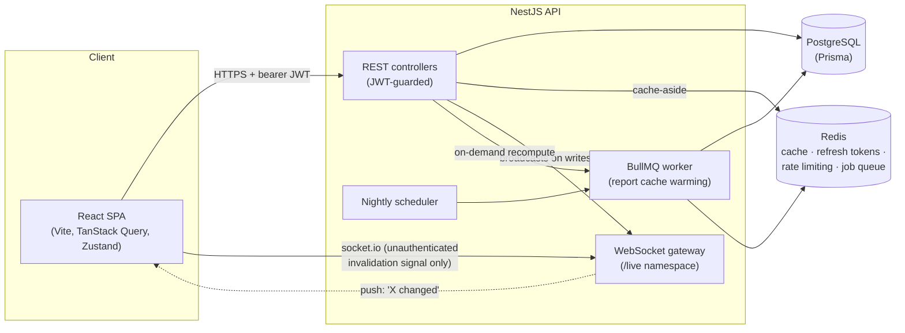

# Camp Dilly Ledger — Platform Edition

A full-stack rebuild of a simpler vanilla-JS Camp Dilly Ledger resort
income/expenditure tracker (a separate, earlier project, not included in
this repo), this time built to demonstrate a real
system-design toolkit rather than to be the simplest thing that works: a
typed monorepo, a normalized relational schema, two different caching
strategies applied where they actually fit, a background job queue, and
live cross-client updates over WebSockets.

The underlying domain is intentionally the same simple CRUD app — day-picnic
and overnight bookings, an in-house store, categorized expenses, reports.
What's different is the architecture around it. Every piece below was
chosen because this app has a genuine use for it, not bolted on for the
resume line; the "why" is explained inline, both here and in code comments.

**For the full technical reference** — module graph, request lifecycle,
class-by-class breakdown, database ER diagram, Redis key namespace, and
sequence diagrams for auth/caching/jobs/WebSocket — see
**[ARCHITECTURE.md](./ARCHITECTURE.md)**. This README stays at the
"why does this exist" level; that document is the "how it's actually
wired together" level.

## Architecture



## What's here and why

| Piece | Why it's here for *this* app |
|---|---|
| **NestJS + TypeScript** | Modular DI, guards, and interceptors replace a lot of the hand-rolled middleware the earlier vanilla-JS build had to write itself — genuinely less code for the same behavior once you're past the framework's setup cost. |
| **PostgreSQL + Prisma** | Real relational storage with indexes on the columns reports actually filter by (`date`, `balanceStatus`, `primary` category), JSONB for the genuinely nested bits (meal counts, payment splits). Migrations are the "right" way to evolve this schema — see the honesty note below on why this repo ships without a committed migration history. |
| **Redis — cache-aside for `/settings`** | Settings barely change but get read on every page load. Cached with a long TTL, invalidated explicitly on write (`cache.del` the moment an admin saves) — a write must never leave stale data to be read back. |
| **Redis — TTL-only cache for `/reports/summary`** | A different consistency need, a different strategy: reports tolerate ~60s of staleness fine, so this cache just expires rather than being explicitly invalidated on every booking write (which would mean recomputing an aggregate query on every single mutation). Two caches, two policies, chosen for what each read actually needs — not the same cache shape copy-pasted twice. |
| **Redis — refresh-token store** | Access tokens are short-lived (15 min) and stateless. Refresh tokens are rotated on every use and their hash lives in Redis keyed by staff id, so a PIN reset or "logout everywhere" is one `DEL` — no Postgres write, and a stolen refresh token dies the moment it's used once. |
| **Redis — rate limiting** | Hand-rolled `INCR` + `EXPIRE` guard (see `redis-throttler.guard.ts`) on `/auth/login`. A 4-6 digit PIN is low-entropy by design (it's meant to be fast to type on a phone at a front desk) — that's exactly the case rate limiting is for. |
| **BullMQ + a nightly cron** | The Reports page runs an aggregation query across four tables. A scheduled job pre-computes and caches "this month" every night at 2am, so the first person opening Reports each morning gets a cache hit instead of paying for that query. The same queue backs an on-demand "Recompute" button — same worker, whether the clock or a human asked. |
| **WebSocket gateway (`/live`)** | When one staff member logs a booking, every other open dashboard updates within a second instead of needing a manual refresh — genuinely useful for a front desk with more than one device. Deliberately unauthenticated and broadcast-only: it carries event *names* ("a booking changed"), never booking data, so there's nothing on that channel worth protecting — the actual data still comes from the guarded REST API. |
| **React + Vite + TypeScript** | TanStack Query owns server state (cache, retries, invalidation) instead of hand-rolled `reload()` calls; Zustand holds the small bit of client state (the in-memory access token); React Hook Form + Zod validate the straightforward field forms; the booking forms with live-computed totals use plain `useState` instead — the derived-state-heavy calculator UI isn't what RHF is for, and using it there anyway would've been the wrong tool for the sake of using it everywhere. |
| **`packages/shared`** | The pricing/meal-count math (`computeDayPicnic`, `computeOvernight`) is a single TypeScript module imported by both the API (authoritative, recomputes on every save) and the web app (instant live preview as the pax steppers are tapped). One implementation, ten Jest tests, no chance of the client's preview and the server's saved number silently drifting apart. |
| **Docker Compose** | `docker compose up` gets you Postgres + Redis + the API + the built web app in one shot — see honesty note on what I could/couldn't verify below. Postgres and Redis are bound to `127.0.0.1` only (never `0.0.0.0`) and Redis requires a password (`--requirepass`, enforced via `${REDIS_PASSWORD:?...}` with no default) — the only port meant to be reachable from outside the host is the web app's. |

## Project layout

```
camp-dilly-showcase/
├── packages/shared/       # types + pricing/meal-count logic (Jest-tested)
├── apps/api/               # NestJS backend
│   ├── prisma/schema.prisma
│   └── src/
│       ├── auth/            # JWT access+refresh, PIN hashing (scrypt)
│       ├── redis/           # cache-manager + raw ioredis client
│       ├── events/          # WebSocket gateway
│       ├── jobs/            # BullMQ processor + nightly scheduler
│       ├── reports/         # cache-aside aggregation
│       ├── settings/        # cache-aside key/value config store
│       ├── income-day/ income-overnight/ store/ expenses/ staff/
│       └── common/          # guards, filters, interceptors, decorators
└── apps/web/               # React frontend
    └── src/
        ├── hooks/            # one TanStack Query hook per resource
        ├── components/       # ui/, charts/ (Recharts), layout/
        ├── pages/            # one per screen
        └── store/            # Zustand: auth token, toast
```

## Running it

### Option A — Docker Compose (the intended path)

```bash
docker compose up --build
```

Then open **http://localhost:8080**. First load walks you through creating
the admin PIN. The API is also reachable directly at `:4000` (Swagger docs
at `http://localhost:4000/docs`).

### Option B — local dev (hot reload)

Requires Postgres and Redis running locally (or point `docker compose up
postgres redis` at just those two and run the apps yourself):

```bash
npm install
cp apps/api/.env.example apps/api/.env   # edit if your Postgres/Redis aren't on localhost defaults
npm run build -w packages/shared
npx prisma db push --skip-generate -w apps/api   # or: cd apps/api && npx prisma db push
npm run dev:api     # NestJS on :4000, restarts on change
npm run dev:web     # Vite on :5173, proxies /api and /live to :4000
```

## Deploying it for real

This app is actually running in production for a real resort — not just a
`docker compose up --build` on a laptop. That's a different deployment
shape, because a live server can't afford to `npm install`/`tsc`/`vite
build` on every deploy (the cheapest reliable VPS for this workload is
1GB RAM with no swap by default — a build step would OOM it), and secrets
can't live in a file that gets `git push`ed.

**`.github/workflows/publish.yml`** builds both Docker images (`api` and
`web`) and pushes them to GitHub Container Registry on every push to
`main`, tagged both `:latest` and `:<commit-sha>`. The server never builds
anything — it only ever pulls.

**`docker-compose.prod.yml`** is a standalone production compose file
(deliberately *not* a Compose override merged with `docker-compose.yml` —
the merge semantics for a service that goes from `build:` to `image:`
across files are subtle enough that getting it wrong on a live server is
worse than the small duplication). It points `api`/`web` at the GHCR
images instead of building locally, keeps Postgres/Redis on
`127.0.0.1`-only with the same mandatory `REDIS_PASSWORD`, and reads all
secrets from a `.env` file that's generated directly on the server
(`openssl rand -hex 32`, `chmod 600`) — never committed, never copied
from a dev machine.

Deploy flow, once a droplet exists with Docker installed:

```bash
# on the server, one-time setup
mkdir -p /opt/resort-tracker && cd /opt/resort-tracker
# generate a real .env here (POSTGRES_PASSWORD, REDIS_PASSWORD,
# JWT_ACCESS_SECRET, JWT_REFRESH_SECRET, WEB_ORIGIN, GHCR_OWNER)

# copy docker-compose.prod.yml to the server as docker-compose.yml, then:
docker compose pull      # pulls pre-built images from GHCR, no build step
docker compose up -d     # starts postgres, redis, api, web
```

Chosen host: a small DigitalOcean droplet in an India-region datacenter
(cheapest reliable option with predictable pricing and no free-tier
capacity risk, for a low-traffic single-resort front-desk tool) — see
[ARCHITECTURE.md §15.4](./ARCHITECTURE.md#154-production-deployment) for
the full picture. The public IP itself isn't published in this repo.

## Honesty note — what I actually verified

This was first built on a machine without Docker installed, so the first
pass of this note said `docker compose up` was untested. Docker got
installed shortly after (with its own saga — a stale WSL2 kernel and a
socket file left locked by a force-killed process along the way), and once
it was up, I ran `docker compose up --build` for real against this exact
repo. What's verified now:

- **`packages/shared`**: all 10 Jest tests pass — the exact pricing math from the flyer (age-banded day-picnic rates, capacity-based overnight extra-person billing, food-cost bifurcation).
- **Both apps build clean and lint clean** — `nest build`, `tsc --noEmit` + `vite build`, `eslint --max-warnings 0`, zero errors anywhere.
- **`docker compose up --build` actually works**, end to end, all four containers reporting healthy: Postgres, Redis, the NestJS API, and the nginx-served web app.
- **Exercised for real against the running containers, not just inspected**: created the admin account and logged in (JWT issued, PIN hashed with scrypt); created a day-picnic booking and confirmed the saved amount matched the pricing math exactly (₹4,050 for 2 full-rate + 1 half-rate pax); called `/reports/summary` twice and confirmed `cached: false` then `cached: true` — the cache-aside behavior working as designed; inspected Redis directly (`redis-cli KEYS *`) and saw exactly the keys the architecture predicts — `report:*`, `settings:bundle`, `refresh:<staffId>`, and BullMQ's own `bull:reports:*` keys; hammered `/auth/login` with bad credentials and watched the rate limiter allow exactly 8 requests before returning `429` on the 9th, per the configured limit; hit the on-demand recompute endpoint and watched the API logs show the BullMQ worker pick up and process the job within milliseconds; confirmed nginx correctly serves the SPA and proxies `/api` through to the backend container.

**Three real bugs only this final integration pass caught** (everything
earlier only caught what static analysis can catch):
1. **Prisma's generated client lands in the monorepo's root `node_modules`**, not `apps/api/node_modules` — npm workspace hoisting. The Dockerfile's `COPY --from=build` was pointed at the wrong path and the container would build "successfully" but crash the moment Prisma tried to load its engine.
2. **`node:20-slim` has no OpenSSL** — Prisma's native engine binaries need libssl and failed with a truncated "Schema engine error" without it. Fixed by installing `openssl` in both Docker stages.
3. **The `/health` endpoint was accidentally behind the global auth guard** — Docker's own healthcheck has no JWT to present, so it was 401ing against itself and the container could never report healthy. Needed an explicit `@Public()`.

None of these three were guessable from reading the code or from any build/
lint/unit-test pass — they only show up when something actually tries to
run the container. That's the honest argument for why "I ran it" is a
different (and stronger) claim than "it type-checks."

## A deliberate simplification worth naming

**No committed Prisma migration history.** `docker-compose.yml` bootstraps
the schema with `prisma db push` rather than `prisma migrate deploy`,
because generating a real migration requires `prisma migrate dev` against a
live Postgres connection, which wasn't available while building this. `db
push` is a legitimate Prisma workflow for exactly this situation (and for
early prototyping generally) but it doesn't give you a reviewable,
versioned schema-change history the way migrations do. To do this properly:
run `npx prisma migrate dev --name init` locally once you have Postgres up,
commit the generated `apps/api/prisma/migrations/` folder, and switch the
Dockerfile's `CMD` from `prisma db push` to `prisma migrate deploy`.

**Refresh tokens in `localStorage`, not an httpOnly cookie.** See the
comment in `apps/web/src/store/authStore.ts` — a production deployment
would set the refresh token as an httpOnly/Secure/SameSite cookie from the
API to close the XSS-exfiltration vector localStorage leaves open. That
needs the API and web app to share a cookie-eligible origin (a reverse
proxy or shared parent domain), which is more setup than fits this
project's "two separate dev ports, `docker compose up` and it works" shape.
Named here rather than silently shipped.
